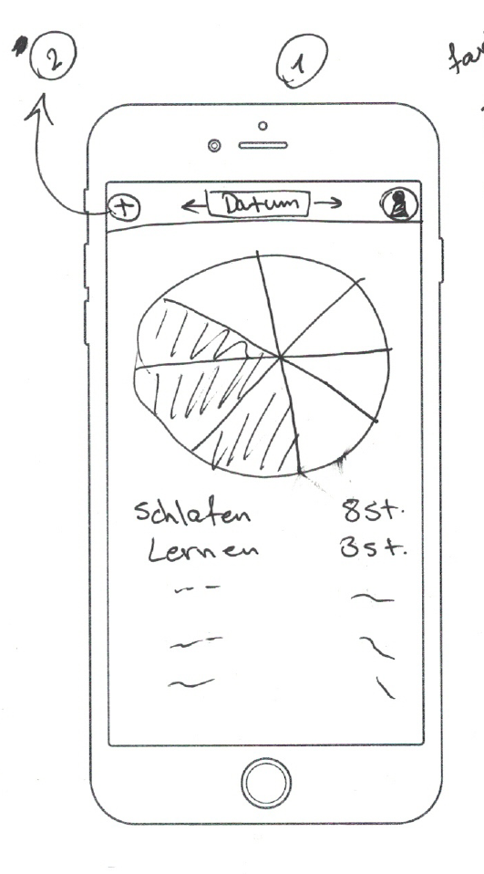
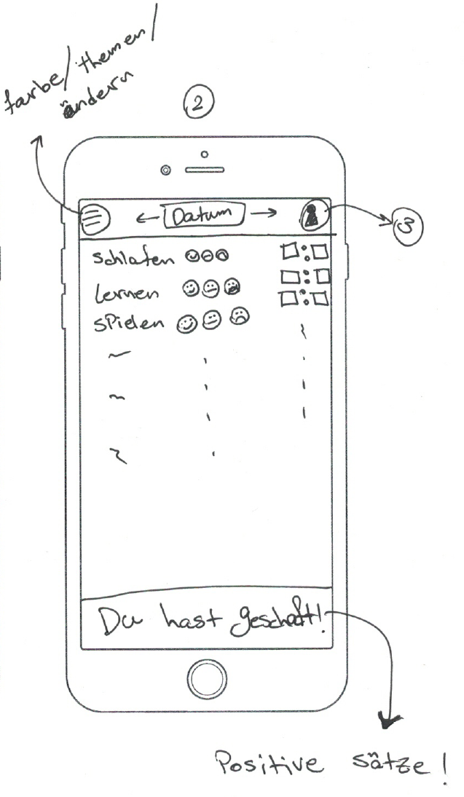
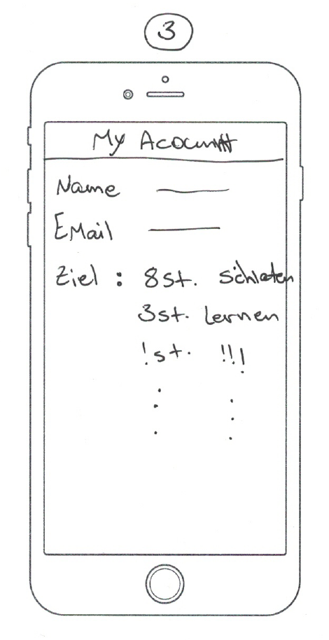

# what-to-do
An App where a user can track how much time he/she spends on average on different activities and set some goals and see if he/she has reached those goals.

## Design Drafts

## Implementation stages
#### Stage 1
Header and main page in Angular
Only Page 1 without Diagram

### Stage 2
Add Page 2 to edit the values

### Stage 3
Add Diagram to page 1

### Stage 4
Save the data on a server

### Stage 5
Add Page 3 and save data for each user

### Stage 6
Publush the App for the world to use <3
